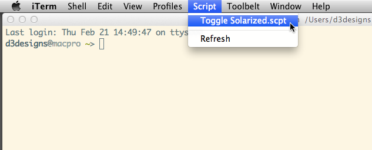

# iTerm2 Toggle Solarized Mode

## Installation

To install place *Toggle Solarized.scpt* inside iTerm's Scripts directory,
which you'll need to create if it doesn't exist, and reload iTerm.

    ~/Library/Application Support/iTerm/Scripts

Now you can switch between light and dark modes, with a click of a button.

Also included is a plain-text version of the script, so you can easily see
what's going on under the hood.

## Screenshot

## Tips

You can toggle via command line too, however this doesn't work properly within
tmux sessions.

    osascript ~/Library/Application\ Support/iTerm/Scripts/Toggle\ Solarized.scpt

